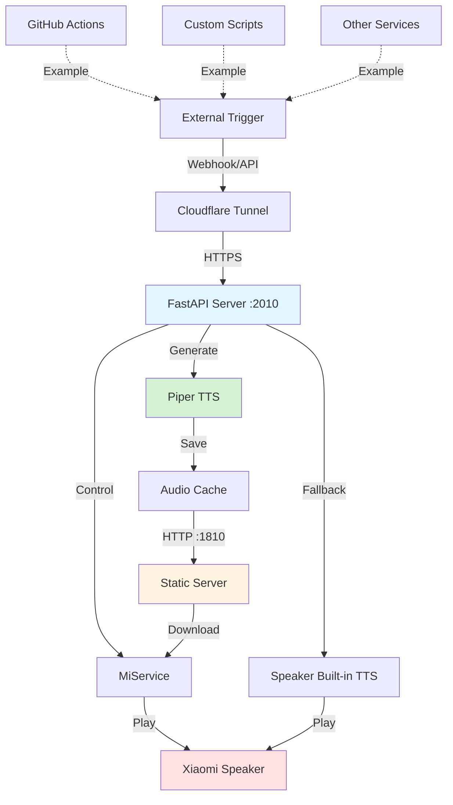

<div align="center">
    

The Voice of Your Code. <br/>你的代码，掷地有声！

# Xiaomi Speaker 智能语音播报系统

通过 Docker 运行的智能语音播报系统，使用 MiService + Piper TTS 实现小米音箱播报任何自定义消息。支持 GitHub Actions 集成、API 调用等多种触发方式。

[](https://hub.docker.com/r/palemoky/xiaomi-speaker)
[](https://hub.docker.com/r/palemoky/xiaomi-speaker)
[](https://github.com/palemoky/xiaomi-speaker/actions/workflows/test.yml)
[](https://www.python.org/downloads/)

</div>

## ✨ 功能特性

- 🔊 **语音播报** - 通过小米音箱播报任何自定义消息
- 🎙 **本地 TTS** - 使用 Piper TTS 生成高质量离线语音(支持中英文)
- 🔄 **智能回退** - 中文自动使用音箱内置 TTS,无需下载模型
- 🎯 **GitHub 集成** - 接收 GitHub webhook 事件(workflow_run, workflow_job, check_run)
- 📲 **HTTP API** - 通过 RESTful API 发送自定义通知
- 🔐 **安全认证** - 支持 API Key 和 GitHub Webhook 签名验证
- 🐳 **容器化部署** - Docker 多架构支持(amd64, arm64)
- 📦 **音频缓存** - 自动缓存生成的音频文件，采用 LRU 缓存策略
- 📬 **并发队列** - 采用队列机制，确保消息处理的顺序性和可靠性
- 🚀 **CI/CD** - GitHub Actions 自动化测试和构建

## 📊 系统架构



## 🚀 快速开始

### 前提条件

- Docker 和 Docker Compose
- 小米音箱
- 小米账号
- Cloudflare 账号（可选，用于公网访问）

### 1. 配置环境变量

```bash
cp .env.example .env
vim .env
```

### 2. 获取小米设备 ID

```bash
# 先在 .env 中设置 MI_USER 和 MI_PASS，然后运行以下命令获取设备列表
docker run --rm --env-file .env palemoky/xiaomi-speaker:latest micli list
```

从输出中找到你的音箱设备 ID（支持 UUID、数字 DID 或设备名称），填入 `.env` 文件的 `MI_DID` 字段。

### 3. 启动服务

```bash
docker-compose up -d
```

服务将在以下端口启动：

- Webhook 服务器: `http://localhost:2010`
- 静态文件服务器: `http://localhost:1810`

### 4. 测试通知

```bash
curl -X POST http://localhost:2010/webhook/custom \
  -H "Content-Type: application/json" \
  -H "Speaker-API-Secret: your_api_secret" \
  -H "CF-Access-Client-Id: your_cf_client_id" \
  -H "CF-Access-Client-Secret: your_cf_client_secret" \
  -d '{"message": "测试通知"}'
```

如果配置正确,音箱应该会播报"测试通知"。

## 🎯 使用场景

### 场景一:自定义脚本通知

在任何脚本中发送语音通知:

```bash
#!/bin/bash
# 备份完成后通知
./backup.sh
if [ $? -eq 0 ]; then
  curl -X POST http://localhost:2010/webhook/custom \
    -H "Content-Type: application/json" \
    -H "Speaker-API-Secret: your_api_secret" \
    -H "CF-Access-Client-Id: your_cf_client_id" \
    -H "CF-Access-Client-Secret: your_cf_client_secret" \
    -d '{"message": "备份任务完成"}'
fi
```

### 场景二:服务器监控告警

```python
import requests

def send_alert(message):
    requests.post(
        "http://localhost:2010/webhook/custom",
        headers={"Speaker-API-Secret": "your_api_secret"},
        params={"cf_client_id": "your_cf_client_id", "cf_client_secret": "your_cf_client_secret"},
        json={"message": message}
    )

# CPU 使用率过高时告警
if cpu_usage > 90:
    send_alert("服务器 CPU 使用率超过 90%")
```

### 场景三:定时任务通知

```bash
# 添加到 crontab
0 9 * * * curl -X POST http://localhost:2010/webhook/custom -H "Content-Type: application/json" -H "Speaker-API-Secret: your_api_secret" -H "CF-Access-Client-Id: your_cf_client_id" -H "CF-Access-Client-Secret: your_cf_client_secret" -d '{"message": "早上好,开始新的一天"}'
```

### 场景四:GitHub Actions 集成

使用官方 [xiaomi-speaker-action](https://github.com/palemoky/xiaomi-speaker-action) 可以更方便地在 GitHub Actions 中发送通知。

## 🌐 Cloudflare Tunnel 配置(可选)

如果需要从公网访问服务(例如接收 GitHub webhook),可以使用 Cloudflare Tunnel。

### 方式一：使用 Docker Compose（推荐）

1. **获取 Tunnel Token**

   - 登录 [Cloudflare Zero Trust Dashboard](https://one.dash.cloudflare.com/)
   - 进入 **Networks** > **Connectors** > **Create a tunnel** > **Select Cloudflared**
   - 命名你的 Tunnel（例如 `xiaomi-speaker`）并保存
   - 在 "Install and run a connector" 页面，找到 Docker 命令中的 token 部分：
     `tunnel run --token <EY...>`
   - 复制这个长字符串 Token

2. **配置 Public Routes**

   - 在 Tunnel 配置页面的 "Published application routes" 标签
   - 添加一个 Hostname（例如 `speaker.yourdomain.com`）
   - **Service** 选择 `HTTP`，URL 填 `xiaomi-speaker:2010` (注意这里用容器名)

3. **更新 .env 文件**
   在 `.env` 文件中添加 Token：

   ```bash
   TUNNEL_TOKEN=eyJhIjoi...
   ```

4. **启动服务**
   ```bash
   docker-compose up -d
   ```

### 方式二：手动安装（CLI）

如果你不想在 Docker 中运行 Tunnel，也可以在宿主机直接安装：

详见 [Cloudflare Tunnel 详细设置](docs/cloudflare-tunnel-setup.md)。

## 🔗 相关项目

- [Xiaomi Speaker Action](https://github.com/palemoky/xiaomi-speaker-action) - GitHub Action 集成
- [MiService](https://github.com/yihong0618/MiService) - 小米云服务接口
- [Piper TTS](https://github.com/rhasspy/piper) - 快速本地神经网络 TTS

---

**⭐ 如果这个项目对你有帮助，请给个 Star！**
