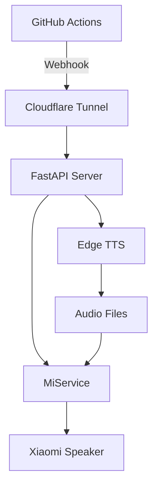

# Xiaomi Speaker GitHub Notification System

通过 Docker 运行的 GitHub 通知系统，使用 MiService + Edge TTS 实现小米音箱播报 GitHub Actions 状态。

[](https://www.docker.com/)
[](https://github.com/features/actions)

## 系统架构



## 功能特性

- ✅ 接收 GitHub webhook 事件（workflow_run, workflow_job, check_run）
- ✅ 使用 Edge TTS 生成自然的中文语音
- ✅ 通过 MiService 控制小米音箱播放
- ✅ Docker 容器化部署，开箱即用
- ✅ 多架构支持（amd64, arm64, arm/v7）
- ✅ 音频文件缓存，提高响应速度
- ✅ 配置化管理，灵活定制

## 快速开始

### 前提条件

- Docker 和 Docker Compose
- 小米音箱
- 小米账号
- Cloudflare 账号（用于公网访问）

### 1. 配置环境变量

```bash
cp .env.example .env
nano .env
```

必须配置以下变量：

```bash
# 小米账号配置
MI_USER=your_xiaomi_account@example.com
MI_PASS=your_xiaomi_password
MI_DID=your_device_id  # 通过下一步获取

# 服务器配置（默认即可）
SERVER_HOST=0.0.0.0
SERVER_PORT=5000
STATIC_SERVER_HOST=0.0.0.0
STATIC_SERVER_PORT=8000

# Edge TTS 配置（可选）
TTS_VOICE=zh-CN-XiaoxiaoNeural  # 晓晓（女声）
```

### 2. 获取小米设备 ID

```bash
# 先在 .env 中设置 MI_USER 和 MI_PASS
# 然后运行以下命令获取设备列表
docker run --rm --env-file .env your-username/xiaomi-speaker:latest uv run micli list
```

从输出中找到你的音箱设备 ID，填入 `.env` 文件的 `MI_DID` 字段。

### 3. 更新镜像名称

编辑 `docker-compose.yml`，将 `your-username` 替换为你的 Docker Hub 用户名：

```yaml
services:
  xiaomi-speaker:
    image: your-username/xiaomi-speaker:latest  # 替换这里
```

### 4. 启动服务

```bash
docker-compose up -d
```

服务将在以下端口启动：
- Webhook 服务器: `http://localhost:5000`
- 静态文件服务器: `http://localhost:8000`

### 5. 测试通知

```bash
curl -X POST http://localhost:5000/webhook/custom \
  -H "Content-Type: application/json" \
  -d '{"message": "测试通知"}'
```

如果配置正确，音箱应该会播报"测试通知"。

## Docker 管理

### 常用命令

```bash
# 查看日志
docker-compose logs -f

# 停止服务
docker-compose stop

# 重启服务
docker-compose restart

# 停止并删除容器
docker-compose down

# 更新镜像并重启
docker-compose pull
docker-compose up -d
```

### 直接使用 Docker 命令

```bash
docker run -d \
  --name xiaomi-speaker \
  --env-file .env \
  -p 5000:5000 \
  -p 8000:8000 \
  -v $(pwd)/audio_cache:/app/audio_cache \
  --restart unless-stopped \
  your-username/xiaomi-speaker:latest
```

## Cloudflare Tunnel 配置

为了让 GitHub 能访问到你的本地服务，我们需要使用 Cloudflare Tunnel。

### 方式一：使用 Docker Compose（推荐）

1. **获取 Tunnel Token**
   - 登录 [Cloudflare Zero Trust Dashboard](https://one.dash.cloudflare.com/)
   - 进入 **Networks** > **Tunnels** > **Create a tunnel**
   - 选择 **Cloudflared**
   - 命名你的 Tunnel（例如 `xiaomi-speaker`）并保存
   - 在 "Install and run a connector" 页面，找到 Docker 命令中的 token 部分：
     `tunnel run --token <EY...>`
   - 复制这个长字符串 Token

2. **配置 Public Hostname**
   - 在 Tunnel 配置页面的 "Public Hostnames" 标签
   - 添加一个 Hostname（例如 `speaker.yourdomain.com`）
   - **Service** 选择 `HTTP`，URL 填 `xiaomi-speaker:5000` (注意这里用容器名)

3. **更新 .env 文件**
   在 `.env` 文件中添加 Token：
   ```bash
   TUNNEL_TOKEN=eyJhIjoi...
   ```

4. **启动服务**
   ```bash
   docker-compose up -d
   ```

### 方式二：手动安装（CLI）

如果你不想在 Docker 中运行 Tunnel，也可以在宿主机直接安装：

详见 [Cloudflare Tunnel 详细设置](docs/cloudflare-tunnel-setup.md)。

## GitHub 集成

### 方式一：配置 Webhook（推荐）

1. 进入 GitHub 仓库 **Settings → Webhooks → Add webhook**
2. 配置：
   - **Payload URL**: `https://your-tunnel-url.com/webhook/github`
   - **Content type**: `application/json`
   - **Events**: 选择 `Workflow runs`
3. 保存

### 方式二：在 Actions 中手动发送

```yaml
name: CI

on: [push, pull_request]

jobs:
  build:
    runs-on: ubuntu-latest
    steps:
      - uses: actions/checkout@v4
      
      - name: Build
        run: npm run build
      
      - name: Send notification
        if: failure()
        run: |
          curl -X POST ${{ secrets.WEBHOOK_URL }}/webhook/custom \
            -H "Content-Type: application/json" \
            -d '{"message": "构建失败：${{ github.repository }}"}'
```

需要在仓库 Settings → Secrets 中添加 `WEBHOOK_URL`。

## 配置选项

所有配置通过 `.env` 文件管理：

| 变量 | 说明 | 默认值 |
|------|------|--------|
| `MI_USER` | 小米账号 | 必填 |
| `MI_PASS` | 小米密码 | 必填 |
| `MI_DID` | 设备 ID | 必填 |
| `SERVER_HOST` | Webhook 服务器地址 | `0.0.0.0` |
| `SERVER_PORT` | Webhook 服务器端口 | `5000` |
| `STATIC_SERVER_HOST` | 静态文件服务器地址 | `0.0.0.0` |
| `STATIC_SERVER_PORT` | 静态文件服务器端口 | `8000` |
| `TTS_VOICE` | Edge TTS 语音 | `zh-CN-XiaoxiaoNeural` |
| `TTS_RATE` | 语速调整 | `+0%` |
| `TTS_VOLUME` | 音量调整 | `+0%` |
| `NOTIFICATION_TEMPLATE_FAILURE` | 失败通知模板 | 见 `.env.example` |
| `NOTIFICATION_TEMPLATE_SUCCESS` | 成功通知模板 | 见 `.env.example` |
| `AUDIO_CACHE_DIR` | 音频缓存目录 | `audio_cache` |
| `GITHUB_WEBHOOK_SECRET` | Webhook 签名密钥（可选） | 无 |

### 可用的 TTS 语音

- `zh-CN-XiaoxiaoNeural` - 晓晓（女声，推荐）
- `zh-CN-YunxiNeural` - 云希（男声）
- `zh-CN-YunyangNeural` - 云扬（男声）
- `zh-CN-XiaoyiNeural` - 晓伊（女声）

## API 端点

### 健康检查
```bash
GET /health
```

### GitHub Webhook
```bash
POST /webhook/github
Content-Type: application/json
X-GitHub-Event: workflow_run

{
  "action": "completed",
  "workflow_run": {
    "name": "CI",
    "conclusion": "failure",
    "repository": {
      "full_name": "user/repo"
    }
  }
}
```

### 自定义通知
```bash
POST /webhook/custom
Content-Type: application/json

{
  "message": "你的自定义消息"
}
```

## 故障排除

### 音箱无法播放

1. 检查小米账号凭据是否正确
2. 确认设备 ID 正确：
   ```bash
   docker-compose exec xiaomi-speaker uv run micli list
   ```
3. 检查音箱是否在线
4. 查看日志：
   ```bash
   docker-compose logs -f
   ```

### Webhook 无响应

1. 检查 Cloudflare Tunnel 是否运行：
   ```bash
   cloudflared tunnel list
   ```
2. 测试本地端点：
   ```bash
   curl http://localhost:5000/health
   ```
3. 查看服务器日志

### TTS 生成失败

1. 检查网络连接
2. 确认 Edge TTS 服务可访问
3. 尝试不同的语音设置

### 容器无法启动

1. 检查 `.env` 文件配置
2. 查看容器日志：
   ```bash
   docker logs xiaomi-speaker
   ```
3. 确认端口未被占用

## 自动构建 Docker 镜像

本项目使用 GitHub Actions 自动构建多架构镜像。

### 配置 GitHub Secrets

在仓库 Settings → Secrets and variables → Actions 中添加：

- `DOCKER_USERNAME` - Docker Hub 用户名
- `DOCKER_PASSWORD` - Docker Hub 访问令牌

### 触发构建

```bash
# 推送到 main 分支自动构建 latest 标签
git push origin main

# 创建版本标签自动构建版本镜像
git tag v1.0.0
git push origin v1.0.0
```

### 支持的架构

- `linux/amd64` - x86_64（普通电脑、服务器）
- `linux/arm64` - ARM64（树莓派 4/5、Apple Silicon）

## 许可证

MIT License

## 相关项目

- [MiService](https://github.com/yihong0618/MiService) - 小米云服务接口
- [Edge TTS](https://github.com/rany2/edge-tts) - 微软 Edge TTS 服务
- [FastAPI](https://fastapi.tiangolo.com/) - 现代 Web 框架
