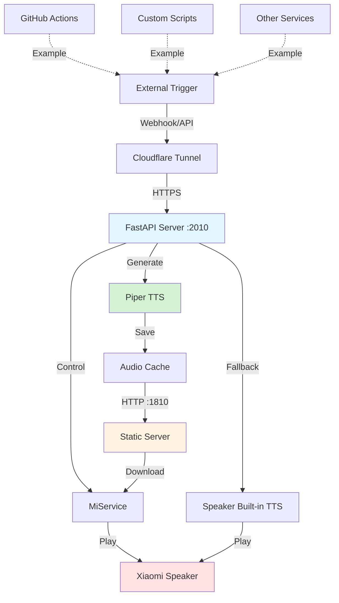

<h3 align="center">
    
    <br>
    The Voice of Your Code. <br/>你的代码，掷地有声！
</h3>

# Xiaomi Speaker 智能语音播报系统

通过 Docker 运行的智能语音播报系统,使用 MiService + Piper TTS 实现小米音箱播报任何自定义消息。支持 GitHub Actions 集成、API 调用等多种触发方式。

[](https://hub.docker.com/r/palemoky/xiaomi-speaker)
[](https://hub.docker.com/r/palemoky/xiaomi-speaker)
[](https://github.com/palemoky/xiaomi-speaker/actions/workflows/test.yml)
[](https://github.com/palemoky/xiaomi-speaker/actions/workflows/release.yml)
[](https://www.python.org/downloads/)

## ✨ 功能特性

- 🔊 **语音播报** - 通过小米音箱播报任何自定义消息
- 🎙 **本地 TTS** - 使用 Piper TTS 生成高质量离线语音(支持中英文)
- 🔄 **智能回退** - 中文自动使用音箱内置 TTS,无需下载模型
- 🎯 **GitHub 集成** - 接收 GitHub webhook 事件(workflow_run, workflow_job, check_run)
- 📲 **HTTP API** - 通过 RESTful API 发送自定义通知
- 🔐 **安全认证** - 支持 API Key 和 GitHub Webhook 签名验证
- 🐳 **容器化部署** - Docker 多架构支持(amd64, arm64)
- 📦 **音频缓存** - 自动缓存生成的音频文件
- 🧪 **完整测试** - 66% 代码覆盖率，81 个单元测试
- 🚀 **CI/CD** - GitHub Actions 自动化测试和构建

## 📊 系统架构



## 🚀 快速开始

### 前提条件

- Docker 和 Docker Compose
- 小米音箱（支持 MiNA 协议）
- 小米账号
- Cloudflare 账号（可选，用于公网访问）

### 1. 配置环境变量

```bash
cp .env.example .env
nano .env
```

**必填配置**：

```bash
# 小米账号配置
MI_USER=your_xiaomi_account@example.com
MI_PASS=your_xiaomi_password
MI_DID=your_device_id  # 通过下一步获取

# 静态文件服务器（重要：必须是音箱能访问的 IP）
STATIC_SERVER_HOST=192.168.1.100  # 修改为你的设备 IP
STATIC_SERVER_PORT=1810
```

**可选配置**：

```bash
# Piper TTS 中文语音（可选，留空则使用音箱内置 TTS）
# PIPER_VOICE_ZH=zh_CN-huayan-medium

# Piper TTS 英文语音
PIPER_VOICE_EN=en_US-lessac-medium

# API 安全认证
API_SECRET=your_strong_random_api_key

# GitHub Webhook 签名验证
GITHUB_WEBHOOK_SECRET=your_webhook_secret
```

### 2. 获取小米设备 ID

```bash
# 先在 .env 中设置 MI_USER 和 MI_PASS
# 然后运行以下命令获取设备列表
docker run --rm --env-file .env palemoky/xiaomi-speaker:latest uv run micli list
```

从输出中找到你的音箱设备 ID（支持 UUID、数字 DID 或设备名称），填入 `.env` 文件的 `MI_DID` 字段。

### 3. 启动服务

```bash
docker-compose up -d
```

服务将在以下端口启动：

- Webhook 服务器: `http://localhost:2010`
- 静态文件服务器: `http://localhost:1810`

### 4. 测试通知

```bash
# 需要提供 API Key（如果配置了 API_SECRET）
curl -X POST http://localhost:2010/webhook/custom \
  -H "Content-Type: application/json" \
  -H "X-API-Key: your_api_secret" \
  -d '{"message": "测试通知"}'
```

如果配置正确,音箱应该会播报"测试通知"。

## 🎯 使用场景

### 场景一:自定义脚本通知

在任何脚本中发送语音通知:

```bash
#!/bin/bash
# 备份完成后通知
./backup.sh
if [ $? -eq 0 ]; then
  curl -X POST http://localhost:2010/webhook/custom \
    -H "Content-Type: application/json" \
    -H "X-API-Key: $API_SECRET" \
    -d '{"message": "备份任务完成"}'
fi
```

### 场景二:服务器监控告警

```python
import requests

def send_alert(message):
    requests.post(
        "http://localhost:2010/webhook/custom",
        headers={"X-API-Key": "your_api_secret"},
        json={"message": message}
    )

# CPU 使用率过高时告警
if cpu_usage > 90:
    send_alert("服务器 CPU 使用率超过 90%")
```

### 场景三:定时任务通知

```bash
# 添加到 crontab
0 9 * * * curl -X POST http://localhost:2010/webhook/custom -H "Content-Type: application/json" -H "X-API-Key: your_secret" -d '{"message": "早上好,开始新的一天"}'
```

### 场景四:GitHub Actions 集成

详见 [GitHub 集成](#github-集成) 章节。

## 🐳 Docker 管理

### 常用命令

```bash
# 查看日志
docker-compose logs -f

# 停止服务
docker-compose stop

# 重启服务
docker-compose restart

# 停止并删除容器
docker-compose down

# 更新镜像并重启
docker-compose pull
docker-compose up -d
```

### 直接使用 Docker 命令

```bash
docker run -d \
  --name xiaomi-speaker \
  --env-file .env \
  -p 2010:2010 \
  -p 1810:1810 \
  -v $(pwd)/audio_cache:/app/audio_cache \
  --restart unless-stopped \
  palemoky/xiaomi-speaker:latest
```

## 🌐 Cloudflare Tunnel 配置(可选)

如果需要从公网访问服务(例如接收 GitHub webhook),可以使用 Cloudflare Tunnel。

### 方式一：使用 Docker Compose（推荐）

1. **获取 Tunnel Token**

   - 登录 [Cloudflare Zero Trust Dashboard](https://one.dash.cloudflare.com/)
   - 进入 **Networks** > **Tunnels** > **Create a tunnel**
   - 选择 **Cloudflared**
   - 命名你的 Tunnel（例如 `xiaomi-speaker`）并保存
   - 在 "Install and run a connector" 页面，找到 Docker 命令中的 token 部分：
     `tunnel run --token <EY...>`
   - 复制这个长字符串 Token

2. **配置 Public Hostname**

   - 在 Tunnel 配置页面的 "Public Hostnames" 标签
   - 添加一个 Hostname（例如 `speaker.yourdomain.com`）
   - **Service** 选择 `HTTP`，URL 填 `xiaomi-speaker:2010` (注意这里用容器名)

3. **更新 .env 文件**
   在 `.env` 文件中添加 Token：

   ```bash
   TUNNEL_TOKEN=eyJhIjoi...
   ```

4. **启动服务**
   ```bash
   docker-compose up -d
   ```

### 方式二：手动安装（CLI）

如果你不想在 Docker 中运行 Tunnel，也可以在宿主机直接安装：

详见 [Cloudflare Tunnel 详细设置](docs/cloudflare-tunnel-setup.md)。

## 🔗 GitHub 集成

### 方式一：配置 Webhook（推荐）

1. 进入 GitHub 仓库 **Settings → Webhooks → Add webhook**
2. 配置：
   - **Payload URL**: `https://your-tunnel-url.com/webhook/github`
   - **Content type**: `application/json`
   - **Events**: 选择 `Workflow runs`
3. 保存

### 方式二：在 Actions 中手动发送

```yaml
name: CI

on: [push, pull_request]

jobs:
  build:
    runs-on: ubuntu-latest
    steps:
      - uses: actions/checkout@v6

      - name: Build
        run: npm run build

      - name: Send notification
        if: failure()
        run: |
          curl -X POST ${{ secrets.WEBHOOK_URL }}/webhook/custom \
            -H "Content-Type: application/json" \
            -d '{"message": "构建失败：${{ github.repository }}"}'
```

需要在仓库 Settings → Secrets 中添加 `WEBHOOK_URL` 和 `API_SECRET`。

## ⚙️ 配置选项

所有配置通过 `.env` 文件管理，详见 [.env.example](file:///Users/xinyu/Workspace/xiaomi-speaker/.env.example)。

### 必填配置

| 变量                 | 说明                          | 示例                                    |
| -------------------- | ----------------------------- | --------------------------------------- |
| `MI_USER`            | 小米账号                      | `user@example.com`                      |
| `MI_PASS`            | 小米密码                      | `your_password`                         |
| `MI_DID`             | 设备 ID（UUID/数字 DID/名称） | `uuid-1234` 或 `12345678` 或 `小米音箱` |
| `STATIC_SERVER_HOST` | 音箱可访问的 IP 地址          | `192.168.1.100`                         |
| `STATIC_SERVER_PORT` | 静态文件服务器端口            | `1810`                                  |

### TTS 配置

| 变量                 | 说明                       | 默认值                |
| -------------------- | -------------------------- | --------------------- |
| `PIPER_VOICE_ZH`     | Piper 中文语音模型（可选） | 留空使用音箱内置 TTS  |
| `PIPER_VOICE_EN`     | Piper 英文语音模型         | `en_US-lessac-medium` |
| `PIPER_SPEAKER`      | 说话人 ID（多说话人模型）  | `0`                   |
| `PIPER_LENGTH_SCALE` | 语速（1.0=正常）           | `1.0`                 |
| `AUDIO_CACHE_DIR`    | 音频缓存目录               | `audio_cache`         |

### 安全配置（可选）

| 变量                    | 说明                    | 生成方法                                                       |
| ----------------------- | ----------------------- | -------------------------------------------------------------- |
| `API_SECRET`            | 自定义 webhook API 密钥 | `python -c "import secrets; print(secrets.token_urlsafe(32))"` |
| `GITHUB_WEBHOOK_SECRET` | GitHub webhook 签名密钥 | 在 GitHub webhook 设置中配置                                   |

### 可用的 Piper 中文语音

- `zh_CN-huayan-medium` - 华研（女声，推荐）
- 更多模型见 [Piper Voices](https://github.com/rhasspy/piper/blob/master/VOICES.md)

## 📡 API 端点

### 健康检查

```bash
GET /health
```

**响应**:

```json
{ "status": "healthy" }
```

### GitHub Webhook

```bash
POST /webhook/github
Content-Type: application/json
X-GitHub-Event: workflow_run
X-Hub-Signature-256: sha256=... (可选，需配置 GITHUB_WEBHOOK_SECRET)

{
  "action": "completed",
  "workflow_run": {
    "name": "CI",
    "conclusion": "success",
    "repository": {
      "full_name": "user/repo"
    },
    "html_url": "https://github.com/user/repo/actions/runs/123"
  }
}
```

**支持的事件**:

- `workflow_run` - 工作流运行完成
- `workflow_job` - 工作流任务完成
- `check_run` - 检查运行完成

### 自定义通知

```bash
POST /webhook/custom
Content-Type: application/json
X-API-Key: your_api_secret (需配置 API_SECRET)

{
  "message": "你的自定义消息"
}
```

**响应**:

```json
{
  "status": "processed",
  "message": "你的自定义消息",
  "notification_sent": true
}
```

## 故障排除

### 音箱无法播放

1. 检查小米账号凭据是否正确
2. 确认设备 ID 正确：
   ```bash
   docker-compose exec xiaomi-speaker uv run micli list
   ```
3. 检查音箱是否在线
4. 查看日志：
   ```bash
   docker-compose logs -f
   ```

### Webhook 无响应

1. 检查 Cloudflare Tunnel 是否运行：
   ```bash
   cloudflared tunnel list
   ```
2. 测试本地端点：
   ```bash
   curl http://localhost:2010/health
   ```
3. 查看服务器日志

### TTS 生成失败

1. 检查网络连接
2. 确认 Edge TTS 服务可访问
3. 尝试不同的语音设置

### 容器无法启动

1. 检查 `.env` 文件配置
2. 查看容器日志：
   ```bash
   docker logs xiaomi-speaker
   ```
3. 确认端口未被占用

## 🧪 开发指南

### 本地开发环境

1. **克隆仓库**

   ```bash
   git clone https://github.com/palemoky/xiaomi-speaker.git
   cd xiaomi-speaker
   ```

2. **安装 UV**

   ```bash
   curl -LsSf https://astral.sh/uv/install.sh | sh
   ```

3. **安装依赖**

   ```bash
   uv sync --all-extras
   ```

4. **配置环境变量**

   ```bash
   cp .env.example .env
   # 编辑 .env 文件
   ```

5. **运行服务**
   ```bash
   uv run python -m src.main
   ```

### 运行测试

```bash
# 运行所有测试
uv run pytest

# 运行测试并生成覆盖率报告
uv run pytest --cov=src --cov-report=html

# 运行特定测试文件
uv run pytest tests/test_api.py

# 并行运行测试
uv run pytest -n auto
```

### 代码质量检查

```bash
# Ruff 代码检查
uv run ruff check src/ tests/

# Ruff 代码格式化
uv run ruff format src/ tests/

# Mypy 类型检查
uv run mypy src/
```

### 提交规范

本项目使用 [Conventional Commits](https://www.conventionalcommits.org/) 规范：

```bash
# 使用 commitizen 创建规范的提交
uv run cz commit

# 或手动编写
git commit -m "feat(api): add new endpoint for notifications"
git commit -m "fix(speaker): resolve connection timeout issue"
```

**可用的 scopes**:

- `api` - API endpoints
- `speaker` - Speaker service
- `tts` - TTS service
- `webhook` - Webhook handlers
- `notification` - Notification service
- `config` - Configuration
- `docker` - Docker related
- `ci` - CI/CD
- `deps` - Dependencies
- `docs` - Documentation
- `test` - Tests

## 🚀 CI/CD

### GitHub Actions 工作流

#### 测试工作流 (`.github/workflows/test.yml`)

每次 push 和 PR 都会自动运行：

- ✅ Ruff 代码检查
- ✅ Mypy 类型检查
- ✅ Pytest 单元测试（81 个测试）
- ✅ 代码覆盖率报告（66%）

#### Docker 构建工作流 (`.github/workflows/docker-build.yml`)

自动构建多架构 Docker 镜像：

- **触发条件**: Push 到 `main` 分支或创建 tag
- **支持架构**: `linux/amd64`, `linux/arm64`
- **镜像标签**:
  - `latest` - main 分支最新版本
  - `v1.0.0` - 版本标签
  - `sha-abc1234` - Git commit SHA

### 配置 GitHub Secrets

在仓库 Settings → Secrets and variables → Actions 中添加：

| Secret               | 说明                | 必需 |
| -------------------- | ------------------- | ---- |
| `DOCKERHUB_USERNAME` | Docker Hub 用户名   | ✅   |
| `DOCKERHUB_TOKEN`    | Docker Hub 访问令牌 | ✅   |

### 发布新版本

```bash
# 使用 commitizen 自动升级版本
uv run cz bump

# 推送 tag 触发构建
git push --follow-tags
```

## 📊 测试覆盖率

当前测试覆盖率：**66%**

| 模块                           | 覆盖率 | 状态 |
| ------------------------------ | ------ | ---- |
| `src/api/webhooks.py`          | 100%   | ✅   |
| `src/config.py`                | 100%   | ✅   |
| `src/utils/language.py`        | 100%   | ✅   |
| `src/services/speaker.py`      | 97%    | ✅   |
| `src/services/notification.py` | 95%    | ✅   |
| `src/server.py`                | 67%    | ⚠️   |
| `src/services/tts.py`          | 21%    | ⚠️   |

## 🤝 贡献指南

欢迎贡献！请遵循以下步骤：

1. Fork 本仓库
2. 创建特性分支 (`git checkout -b feat/amazing-feature`)
3. 提交更改 (`git commit -m 'feat: add amazing feature'`)
4. 推送到分支 (`git push origin feat/amazing-feature`)
5. 开启 Pull Request

**贡献前请确保**:

- ✅ 所有测试通过
- ✅ 代码通过 Ruff 和 Mypy 检查
- ✅ 添加了必要的测试
- ✅ 更新了相关文档

## 📄 许可证

MIT License - 详见 [LICENSE](LICENSE) 文件

## 🔗 相关项目

- [MiService](https://github.com/yihong0618/MiService) - 小米云服务接口
- [Piper TTS](https://github.com/rhasspy/piper) - 快速本地神经网络 TTS
- [FastAPI](https://fastapi.tiangolo.com/) - 现代 Web 框架

## 📮 联系方式

- GitHub Issues: [提交问题](https://github.com/palemoky/xiaomi-speaker/issues)
- Email: palemoky@gmail.com

---

**⭐ 如果这个项目对你有帮助，请给个 Star！**
